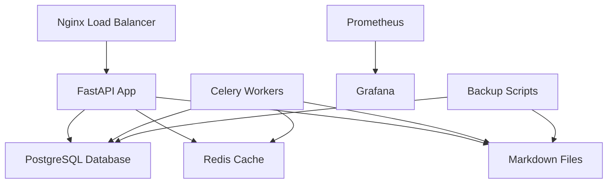

# Article Monster - Production Deployment Guide

This comprehensive guide covers deploying the Article Monster system to production with enhanced markdown file storage, comprehensive monitoring, and cloud deployment options.

## 🚀 Quick Start

### Prerequisites

- Docker and Docker Compose
- Git
- SSL certificate (for HTTPS)
- Email account with app-specific password
- Kindle email: `vole-paradox-suppress@kindle.com`

### Basic Production Deployment

1. **Clone and configure:**
   ```bash
   git clone <repository-url>
   cd article-monster
   cp .env.prod.example .env.prod
   # Edit .env.prod with your actual values
   ```

2. **Generate secrets:**
   ```bash
   ./scripts/generate_secrets.sh
   ```

3. **Deploy with Docker Compose:**
   ```bash
   docker-compose -f docker-compose.prod.yml up -d
   ```

4. **Access your application:**
   - Main app: https://your-domain.com
   - Monitoring: http://your-domain.com:3000 (Grafana)
   - Metrics: http://your-domain.com:9090 (Prometheus)

## 🗃️ Enhanced Markdown Storage

The system now stores articles as browsable markdown files with YAML frontmatter while maintaining database indexes for fast querying.

### Directory Structure

```
/app/articles/
├── README.md                 # Main index with statistics
├── inbox/                    # New articles awaiting processing
├── processed/               # Articles ready for reading
│   ├── 2024/01/            # Organized by year/month
│   └── 2024/02/
├── sent/                    # Articles sent to Kindle
├── archive/                 # Older articles
├── newsletters/             # Newsletter-extracted articles
├── rss/                     # RSS feed articles
├── drafts/                  # Articles being edited
└── metadata/               # Index files and exports
```

### Article Format

Each article is stored as a markdown file with YAML frontmatter:

```markdown
---
title: "Article Title"
url: "https://example.com/article"
author: "Author Name"
publication_date: "2024-01-15T10:30:00+00:00"
created_at: "2024-01-15T10:30:00+00:00"
updated_at: "2024-01-15T10:30:00+00:00"
source: "url"
tags: ["tech", "ai", "productivity"]
processed: false
sent_to_kindle: false
file_id: "abc123def456"
word_count: 1250
reading_time_minutes: 6
---

# Article Title

Article content in markdown format...
```

### API Endpoints for File Management

- `GET /api/v1/articles/files/browse?path=processed/2024/01` - Browse files
- `GET /api/v1/articles/files/read?path=processed/2024/01/article.md` - Read file
- `POST /api/v1/articles/sync` - Sync database with files
- `POST /api/v1/articles/regenerate-indexes` - Update index files

## 🏗️ Architecture Overview



## 🐳 Docker Deployment Options

### Option 1: Docker Compose (Recommended for single server)

```bash
# Production deployment
docker-compose -f docker-compose.prod.yml up -d

# View logs
docker-compose -f docker-compose.prod.yml logs -f

# Scale workers
docker-compose -f docker-compose.prod.yml up -d --scale worker=4

# Stop services
docker-compose -f docker-compose.prod.yml down
```

### Option 2: Docker Swarm (For multi-server setup)

```bash
# Initialize swarm
docker swarm init

# Create secrets
docker secret create postgres_password secrets/postgres_password.txt
docker secret create secret_key secrets/secret_key.txt

# Deploy stack
docker stack deploy -c docker-compose.prod.yml article-monster

# Scale services
docker service scale article-monster_worker=4
```

## ☸️ Kubernetes Deployment

### Prerequisites

- Kubernetes cluster (1.25+)
- kubectl configured
- Helm (optional, for monitoring)

### Deployment Steps

1. **Apply manifests:**
   ```bash
   kubectl apply -f k8s/namespace.yaml
   kubectl apply -f k8s/secrets.yaml  # Update with actual secrets first
   kubectl apply -f k8s/postgresql.yaml
   kubectl apply -f k8s/redis.yaml
   kubectl apply -f k8s/application.yaml
   kubectl apply -f k8s/monitoring.yaml
   kubectl apply -f k8s/ingress.yaml
   ```

2. **Verify deployment:**
   ```bash
   kubectl get pods -n article-monster
   kubectl get services -n article-monster
   ```

3. **Access application:**
   ```bash
   kubectl port-forward svc/article-monster-service 8000:8000 -n article-monster
   ```

## ☁️ Cloud Provider Deployment

### DigitalOcean

```bash
cd deploy/digitalocean
./deploy.sh --domain yourdomain.com
```

This script will:
- Create DOKS cluster
- Set up container registry
- Deploy application with ingress
- Configure SSL with Let's Encrypt

### AWS EKS

```bash
cd deploy/aws
./deploy.sh --domain yourdomain.com --region us-east-1
```

This script will:
- Create EKS cluster
- Set up ECR repository
- Deploy with ALB ingress
- Configure monitoring with AMP/AMG

### Google Cloud Platform

```bash
cd deploy/gcp
./deploy.sh --domain yourdomain.com --zone us-central1-a
```

## 🔧 Configuration

### Environment Variables

Key production settings in `.env.prod`:

```bash
# Database
POSTGRES_PASSWORD=your_secure_password

# Application
SECRET_KEY=your_super_secret_key
ALLOWED_HOSTS=yourdomain.com,www.yourdomain.com
ENVIRONMENT=production

# Email Configuration
SMTP_SERVER=smtp.gmail.com
SMTP_USERNAME=your_email@gmail.com
SMTP_PASSWORD=your_app_password
KINDLE_EMAIL=vole-paradox-suppress@kindle.com

# Performance
DB_POOL_SIZE=20
MAX_WORKERS=4
REDIS_MAX_MEMORY=256mb

# Monitoring
GRAFANA_PASSWORD=secure_grafana_password
```

### SSL/TLS Configuration

1. **Let's Encrypt (Automatic):**
   - Configured in ingress manifests
   - Automatic renewal

2. **Custom Certificate:**
   ```bash
   # Place certificates in nginx/ssl/
   cp your-cert.pem nginx/ssl/cert.pem
   cp your-key.pem nginx/ssl/key.pem
   ```

## 📊 Monitoring and Observability

### Metrics Dashboard

Access Grafana at `http://your-domain:3000`:
- Default login: `admin` / `[GRAFANA_PASSWORD]`
- Pre-configured dashboards for:
  - Application performance
  - Database metrics
  - System resources
  - Celery workers

### Available Metrics

- HTTP request metrics
- Database connection pool
- Redis performance
- Celery task metrics
- System resources (CPU, memory, disk)

### Alerts

Configured alerts for:
- High CPU/memory usage
- Application downtime
- Database connection issues
- Failed Celery tasks

### Log Aggregation

Structured JSON logs are collected from:
- FastAPI application
- Celery workers
- Nginx access logs
- PostgreSQL logs

## 🔄 Backup and Recovery

### Automated Backups

Daily backups are configured via:
```bash
# Run backup manually
./scripts/backup/backup.sh

# Restore from backup
./scripts/backup/restore.sh -f latest -a -y
```

Backups include:
- PostgreSQL database dump
- Article markdown files
- Application configuration

### Backup Storage

- Local storage: `/backups` directory
- S3 integration (configure AWS credentials)
- Retention: 30 days (configurable)

### Disaster Recovery

1. **Database restoration:**
   ```bash
   ./scripts/backup/restore.sh -f backup_timestamp
   ```

2. **File system sync:**
   ```bash
   # Sync articles from backup
   rsync -av /backups/articles/ /app/articles/
   
   # Regenerate indexes
   curl -X POST http://localhost:8000/api/v1/articles/regenerate-indexes
   ```

## 🔒 Security Configuration

### Network Security

- Internal networks for database/Redis
- Rate limiting on API endpoints
- Security headers (HSTS, CSP, etc.)
- Input validation and sanitization

### Secrets Management

1. **Docker Secrets:**
   ```bash
   echo "password" | docker secret create postgres_password -
   ```

2. **Kubernetes Secrets:**
   ```bash
   kubectl create secret generic article-monster-secrets \
     --from-literal=postgres-password=your_password
   ```

3. **External secret management:**
   - AWS Secrets Manager
   - HashiCorp Vault
   - Azure Key Vault

### SSL/TLS

- TLS 1.2+ enforcement
- Strong cipher suites
- HSTS headers
- Certificate pinning (optional)

## 🚀 CI/CD Pipeline

GitHub Actions pipeline includes:

1. **Continuous Integration:**
   - Code linting (Black, isort, flake8)
   - Type checking (mypy)
   - Unit tests with coverage
   - Security scanning (Bandit, Trivy)

2. **Continuous Deployment:**
   - Automated builds on push
   - Staging deployment on develop branch
   - Production deployment on releases
   - Rollback capabilities

### Pipeline Configuration

```yaml
# .github/workflows/ci-cd.yml
- Automated testing
- Security scanning
- Docker image building
- Multi-environment deployment
- Slack notifications
```

## 📈 Performance Optimization

### Database Optimization

- Connection pooling (20 connections default)
- Query optimization with indexes
- Automated vacuuming
- Performance monitoring

### Caching Strategy

- Redis for session storage
- Application-level caching
- Database query result caching
- Static file caching

### Resource Limits

Production resource allocation:
- App containers: 1GB RAM, 1 CPU
- Database: 1GB RAM, 1 CPU  
- Redis: 512MB RAM, 0.5 CPU
- Workers: 1GB RAM, 1 CPU each

## 🛠️ Maintenance

### Regular Tasks

1. **Weekly:**
   - Review monitoring dashboards
   - Check backup success
   - Review security logs

2. **Monthly:**
   - Update dependencies
   - Review performance metrics
   - Clean up old logs/backups

3. **Quarterly:**
   - Security audit
   - Disaster recovery test
   - Performance optimization review

### Health Checks

Monitor these endpoints:
- `/health` - Basic health check
- `/health/detailed` - Comprehensive health status
- `/metrics` - Prometheus metrics
- `/api/v1/articles/health` - Article service health

### Troubleshooting

Common issues and solutions:

1. **Database connection issues:**
   ```bash
   kubectl logs deployment/postgres -n article-monster
   ```

2. **High memory usage:**
   ```bash
   kubectl top pods -n article-monster
   ```

3. **File system issues:**
   ```bash
   kubectl exec -it deployment/article-monster-app -n article-monster -- ls -la /app/articles
   ```

## 📞 Support and Maintenance

### Monitoring Contacts

- Application alerts: Check Grafana dashboards
- Infrastructure alerts: Monitor cloud provider console
- Backup failures: Check backup logs in `/backups/backup.log`

### Scaling

Horizontal scaling options:
```bash
# Docker Compose
docker-compose -f docker-compose.prod.yml up -d --scale app=3 --scale worker=4

# Kubernetes
kubectl scale deployment article-monster-app --replicas=3 -n article-monster
kubectl scale deployment celery-worker --replicas=4 -n article-monster
```

### Updates and Maintenance

1. **Application updates:**
   ```bash
   # Pull latest image
   docker-compose -f docker-compose.prod.yml pull
   
   # Rolling update
   docker-compose -f docker-compose.prod.yml up -d
   ```

2. **Database migrations:**
   ```bash
   # Run migrations
   docker-compose -f docker-compose.prod.yml exec app alembic upgrade head
   ```

This production deployment guide provides a robust, scalable, and maintainable solution for the Article Monster system with enhanced markdown file storage capabilities.